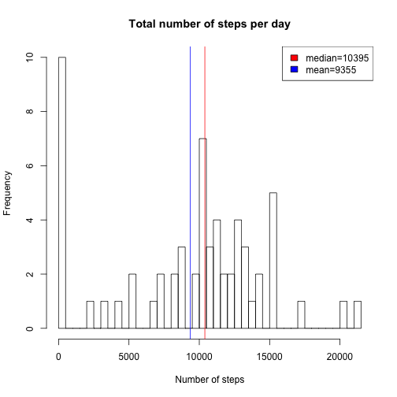
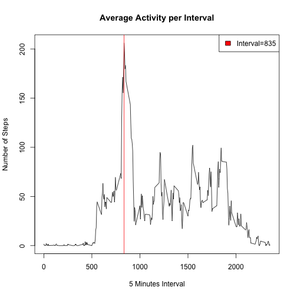
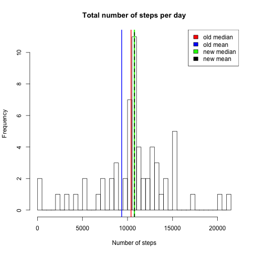
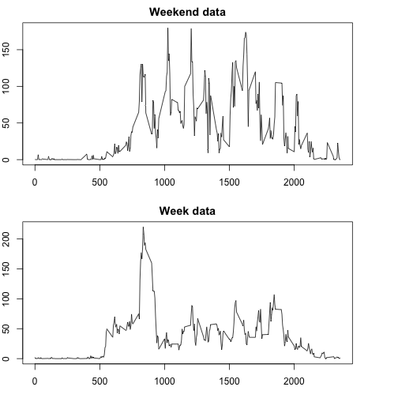

# "Reproducible Research: Peer Assessment 1"
#output: 
#  html_document:
#    keep_md: true
#---


## Loading and preprocessing the data

```r
setwd("/Users/ugurural/Desktop/Data_Science/ReproducibleResearch/Project1/RepData_PeerAssessment1/")
activitydata<-read.csv("activity.csv")#colClasses=c("numeric","POSIXct","numeric")
repeatdata<-read.csv("activity.csv",colClasses=c("numeric","POSIXct","numeric"))
col4<-weekdays(repeatdata$date)                     
activityperweekday<-cbind(repeatdata$steps,repeatdata$date,repeatdata$interval,col4)
rm(repeatdata,col4)
```
Two versions of data are stored: In the first one the dates are saved as a factor variable, in the second one the dates are saved as a POSIXct class which can be manipulated with the weekdays() function for the last question.


## What is mean total number of steps taken per day?

```r
dailysums<-tapply(activitydata$step,activitydata$date,sum,na.rm=TRUE)
mediandailysteps<-median(dailysums)
meandailysteps<-mean(dailysums)
```

The median of the total number of steps per day is 10395 and higher than the mean value which is 9355, which shows that, the mean was biased towards a lower value because of low outliers.


```r
hist(dailysums,breaks=61,main="Total number of steps per day",xlab="Number of steps")
abline(v=mediandailysteps,col="red")
abline(v=meandailysteps,col="blue")
legend("topright",c("median=10395","mean=9355"),fill=c("red","blue"))
```

 


## What is the average daily activity pattern?
The simplest way calculate the mean of the number of steps belonging to each 5 minutes interval is to use one of the loop functions. Tapply is chosen as it loops easily over a subset of the data.


```r
AverageInt<-tapply(activitydata$steps,activitydata$interval,mean,na.rm=TRUE)
```

Time series plotted below, shows that, there is a large variation between the beginning and the end of the daily intervals. Maximum number of steps are taken at the interval
835.


```r
plot(names(AverageInt),AverageInt,type="l",main="Average Activity per Interval",xlab="5 Minutes Interval",ylab="Number of Steps")
abline(v=names(AverageInt[AverageInt==max(AverageInt)]),col="red")
legend("topright",c("Interval=835"),fill=c("red"))
```

 


## Imputing missing values
### Part 1
The total number of missing values is 2304, it was calculated using:

```r
sum(is.na(activitydata))
```

```
## [1] 2304
```

### Part 2
As the variation is high between different intervals of each day, it is better to replace the missing values with the interval mean calculated on the step above.

### Part 3
The data set is completed by searching for the missing values using the is.na function, checking the 5 minutes interval of the particular observation and by replacing the NA value with 
the average step value that was calculated for that interval.


```r
newStepsData<-activitydata[,1]
AverageIntData<-data.frame(as.integer(names(AverageInt)),AverageInt)
names(AverageIntData)<-c("interval","average")
for (i in seq(length(activitydata[,1]))){
    if (is.na(activitydata$steps[i])==1){
    newStepsData[i]<-AverageIntData$average[AverageIntData$interval==activitydata$interval[i]]
    }
}
newActivityData<-data.frame(newStepsData,activitydata$date,activitydata$interval)
names(newActivityData)=c("steps","date","interval")
```

The daily total number of steps, mean and the median are calculated the same way as in question 1. 


```r
newdailysums<-tapply(newActivityData$steps,newActivityData$date,sum,na.rm=TRUE)
newmediandailysteps<-median(newdailysums)
newmeandailysteps<-mean(newdailysums)
```

So now the initial data set which had missing values:


```r
head(activitydata)
```

```
##   steps       date interval
## 1    NA 2012-10-01        0
## 2    NA 2012-10-01        5
## 3    NA 2012-10-01       10
## 4    NA 2012-10-01       15
## 5    NA 2012-10-01       20
## 6    NA 2012-10-01       25
```
is transformed to:

```r
head(newActivityData)
```

```
##       steps       date interval
## 1 1.7169811 2012-10-01        0
## 2 0.3396226 2012-10-01        5
## 3 0.1320755 2012-10-01       10
## 4 0.1509434 2012-10-01       15
## 5 0.0754717 2012-10-01       20
## 6 2.0943396 2012-10-01       25
```

### Part 4


It is seen from the histogram below that both the mean and the medium
increased as we included replaced the NA values. This is normal as
previously,rm.na=TRUE command was forcing the sum to include less observations although the averages were still calculated by dividing by the same number of observations. On the other hand the mean and the median which were different in the initial incomplete data sets are now the same (green and black lines are on top of each other). This is also expected as by adding the average value to the data set many times, we got a more central distribution which is less effected by the extreme values.


```r
hist(newdailysums,breaks=61,main="Total number of steps per day",xlab="Number of steps")
abline(v=mediandailysteps,col="red",lwd=2)
abline(v=meandailysteps,col="blue",lwd=2)
abline(v=newmediandailysteps,col="green",lwd=3)
abline(v=newmeandailysteps,col="black",lwd=2,lty=2)
legend("topright",c("old median","old mean","new median","new mean"),fill=c("red","blue","green","black"))
```

 

## Are there differences in activity patterns between weekdays and weekends?

For this exercise, the activityperweekday data set loaded at the beginning is used, as it has the weekday information. In addition the steps in the first column are taked from unbiased data set the steps are  newActivityData obtained in the last exercise. First the days are stored in a new column that has a two-leveled factor. Then we apply tapply again to week and weekend days' subsets for each 5 minutes interval.


```r
DayOfWeek<-vector(mode="character",length=17568)
for (i in 1:17568){
    if (activityperweekday[i,4]=="Saturday"){
            DayOfWeek[i]<-"Weekend"
            } 
    if(activityperweekday[i,4]=="Sunday"){
            DayOfWeek[i]<-("Weekend")  
            } else{
            DayOfWeek[i]<-("Weekday")
    }
    }

WeekDayData<-data.frame(newActivityData$steps,newActivityData$interval,DayOfWeek)
names(WeekDayData)<-c("steps","interval","Weekday")
SubsetWeek<-WeekDayData[WeekDayData$Weekday=="Weekday",1:2]
SubsetWeekend<-WeekDayData[WeekDayData$Weekday=="Weekend",1:2]
WeekAverageInt<-tapply(SubsetWeek[,1],SubsetWeek[,2],mean,na.rm=TRUE)
WeekendAverageInt<-tapply(SubsetWeekend[,1],SubsetWeekend[,2],mean,na.rm=TRUE)
```

The plot below shows the difference between the average step taken at each 5 minutes interval in the week or weekend days. The main difference is that the steps is distributed more evenly in the weekends while it peaks at a more specific time in the week.


```r
par(mfrow=c(2,1),mar=c(3,2,2,4))
plot(names(WeekendAverageInt),WeekendAverageInt,type="l",main="Weekend data",ylab="Number of Steps",xlab="")
plot(names(WeekAverageInt),WeekAverageInt,type="l",main="Week data",xlab="5 Minutes Interval",ylab="Number of Steps")
```

 
The final report was produced in an R Markdown file, and compiled with knit2html("PA1_template.Rmd").


